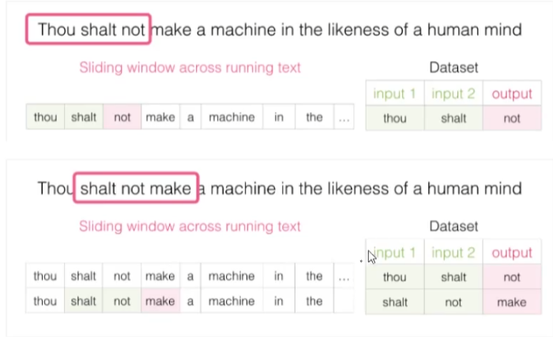
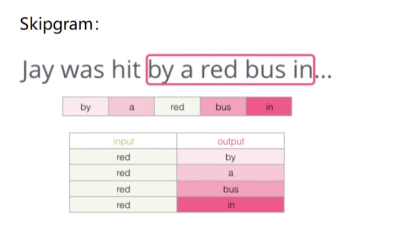
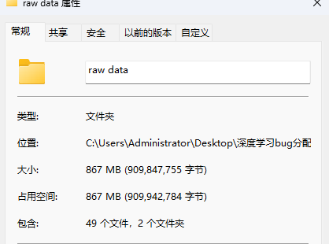

# 基于深度学习的软件缺陷报告自动分派研究

## 预备知识

缺陷报告，针对这个有不同的定义。在基于开发者多元特征的软件缺陷自动分派方法_董夏磊.pdf一文中，

> 一 个 缺 陷 报 告 主 要 包 括 ： 摘 要 （Summary） 、 预定义字段（Pre-defined Filed） 、 修复历史（History） 、 描 述 （Description）和评论（Comment）5 个主要部分

但是在软件测试行业里缺陷报告更复杂一些，是这样定义的。

>  1、缺陷编号（defect id）
>
> ​     2、缺陷标题（summary）
>
> ​     3、缺陷的发现者（detected by）
>
> ​     4、发现缺陷的日期（detected on date）
>
> ​     5、发现缺陷的功能模块（subject）
>
> ​     6、指派给（assigned to）
>
> ​     7、发现缺陷的版本（detected in release）
>
> ​       （1）说明：不仅指最后的发布版本，也指软件开发过程中出现的“临时版本”
>
> ​       （2）回归测试：在新版本中对原来版本测试过的内容再重新测试一遍
>
> ​            原因：1、新功能对原有功能可能有影响
>
> ​                  2、缺陷修改后也有可能对原有功能产生影响
>
> ​            为了提高回归测试的效率，很多企业使用自动化工具做回归测试
>
> ​     8、缺陷的状态（status）最常见的考试题**
>
> ​       （1）说明：指明缺陷当前所需什么处理和缺陷当前处于什么处理状况
>
> ​       （2）缺陷的处理过程：重点
>
> ​           步骤1：测试人员将缺陷报告提交给开发经理，
>
> ​                  将缺陷报告状态设置成：New（新的缺陷）
>
> ​           步骤2：开发经理验证缺陷：
>
> ​                  情况1：如果验证是缺陷，将缺陷指派给相应的开发人员，
>
> ​                        并将缺陷状态设置成open
>
> ​                        open：（打开的缺陷，被开发方承认的缺陷）
>
> ​                  情况2：如果验证不是缺陷，开发经理会拒绝此缺陷，将缺陷
>
> ​                        状态设置成：rejected。（一般要汇报给测试组长或
>
> ​                        测试经理，有时会邀请开发人员参加，开讨论会解决）
>
> ​           步骤3：开发人员要修改缺陷，修改完成后，将缺陷状态设置成：fixed
>
> ​                 fixed:（修改过的缺陷，即待返测的缺陷）
>
> ​           步骤4：测试人员返测开发人员更改过的缺陷
>
> ​                 情况1：返测通过，将缺陷状态设置成：closed
>
> ​                       closed:（关闭的缺陷，可归档）
>
> ​                 情况2：返测没通过，将缺陷状态设置成：reopen
>
> ​                       reopen:（重新打开的缺陷）
>
> ​                       开发人员继续修改缺陷直到缺陷被返测成功为止。
>
> ​     9、缺陷的严重程度（severity） 【说明缺陷有多糟糕或者对软件的影响有多大】
>
> ​        严重程度的级别：
>
> ​           （1）urgent：造成死机，系统崩溃等致命问题
>
> ​           （2）very high：非常严重的问题
>
> ​           （3）high：严重的问题
>
> ​           （4）medium：中等程度的问题
>
> ​           （5）low：小问题
>
> ​        发现问题：级别定义是泛泛的笼统的，容易引发争议，需要制定详细的标准
>
> ​        注意：每个级别的含义，不同企业、不同项目组都可能不同，需要在专门的
>
> ​             文档中定义好细则，在缺陷报告中作为参考。
>
> ​     10、缺陷的优先级（priority）
>
> ​        希望程序员在什么时间内或者在程序的哪个版本中解决该缺陷（Bug）
>
> ​        优先级的级别：
>
> ​           （1）urgent：立即修改，否则会影响开发或测试的进度
>
> ​           （2）very high：本版本中解决
>
> ​           （3）high： 下一版本中解决
>
> ​           （4）medium：发布之前解决
>
> ​           （5）low：尽量在发布之前解决
>
> ​         注意：对于每个级别的具体定义，不同公司不一定完全相同，
>
> ​              实际工作中要注意参考公司的文档。
>
> ​         影响优先级的因素：
>
> ​            （1）考虑缺陷的严重程度：一般是越严重，优先级别越高
>
> ​               （也不是绝对的，有时严重级别低，但优先级高，例如：界面错字）
>
> ​            （2）缺陷影响的范围：一般影响范围越大，优先级越高
>
> ​            （3）开发组的任务压力：进度压力越小，优先级越高
>
> ​            （4）解决缺陷的成本(时间)：成本越低，优先级越高 （例如:改错字）
>
> ​     11、缺陷的描述（description）
>
> ​         描述缺陷产生的操作过程，使程序员能重现缺陷。（缺陷报告不是必须
>
> ​         要遵守什么写法和规则，只要程序员能看明白能重现缺陷就可以）
>

## 词向量模型 Word2Vec ✳

> 这玩意的目的就是为了在高维空间中，让语义相近的词之间离的近一些，让语义相差很大的词离的远一些。

> [!NOTE]
>
> 通常向量维度越高，能够提供的信息也就越多，从而计算结果的可靠性更值得信赖。

在向量的热度图中的情况如下。

### 构建训练数据 

构建训练数据的过程采用了滑动窗口，只要是文本就行，前后有语义关系。

### 不同模型间的对比

CBOW模型由上下文推中间词

Skipgram由中间词推断上下文。

one-hot

稀疏向量采用一位 有效编码（one-hot）向量形式，即每个向量的维度为整个词 汇表的大小，只有单词在相应词汇表位置的数字为 1，其余 全为 0。

缺点：

维度灾难

无法度量词语之间的相似性

稠密向量，其向量长度一般为 100~600 维，远远小 于词汇表的大小，但它可以表示词与词之间更丰富的语义相 似程度。

# 相似项目探索

我发现6年前就有人在做这个课题，还意外收获了他们的代码。

下面是武汉大学的硕士论文的代码，我看了看论文的大概，它采用的数据集是经过爬虫爬取的**20w**条bug数据 来自eclipse和mozilla，然后这个数据集不是他爬的，是他引用的那篇论文的作者爬的。然后我也找到了这个他引用的这个论文的作者爬取的数据集，非常大。

 它采用的方法是先将这些bug转化为词向量，提前训练好的词向量作为基准向量，即基于 Word2Vec[25]的 CBoW（Continuous Bag-of-Words）模型在 Google News 数 据集（约 1000 亿个单词）上训练的词向量模型（下载网址： https://code.google.com/archive/p/word2vec）

可参考项目地址

[huazhisong/DeepTriage: DeepTriage 使用CNN，RNN相关深度学习算法实现bug精确分配。DeepTriage: deep learning algorithm is used to achieve precise bug triage (github.com)](https://github.com/huazhisong/DeepTriage)

## 下一步计划

继续学习并巩固相关词分类的深度学习网络，然后这两天把上面这个项目跑一下，然后理解里面的算法调用，这个项目使用的是1080跑的，我感觉自己电脑的3060可以承受的住。  然后试试能不能把代码换成xlent或者其他模型。

## 相似项目运行日志

